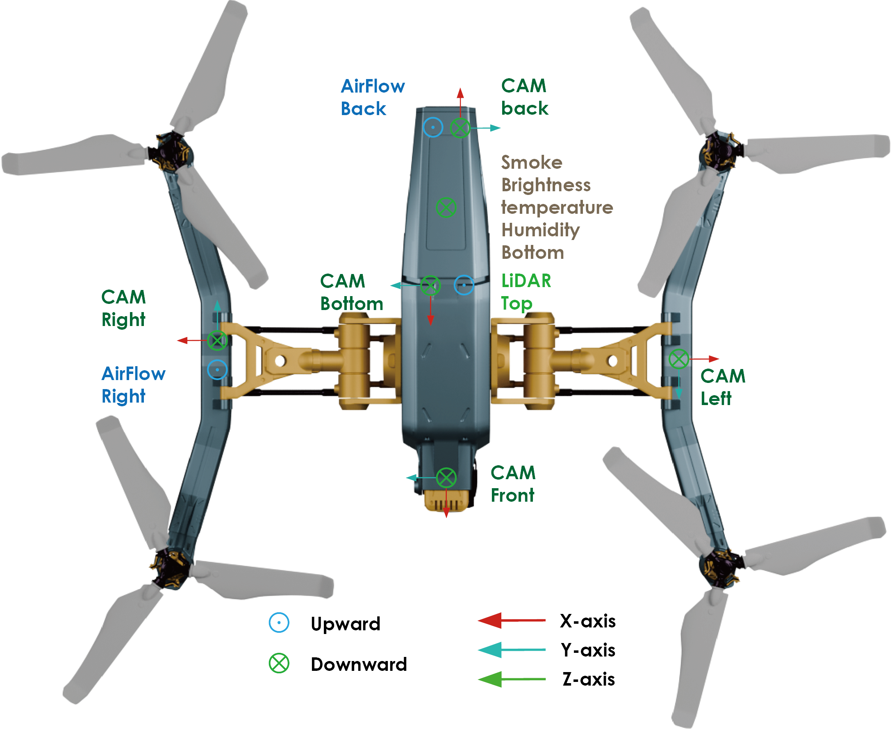

<div align="center">
  

</div>
If you find this work useful or interesting, please kindly give us a star ⭐, thanks!😀

[](https://fengtongtong.github.io/static/files/publications_file/2024-MM.pdf)
[](https://drive.google.com/drive/folders/1yc4Oe0E2Qn-1I1_G3gBgoww3LAf7iyLg?usp=sharing) 
[]()
[](https://github.com/fengtt42/U2UData)

<strong>U2U*</strong> is a cooperative perception simlator, dataset and benchmark for swarm UAVs autonomous flight. It is also the official implementation of the <strong> ACM MM 2024  </strong>
paper [U2UData.](https://fengtongtong.github.io/static/files/publications_file/2024-MM.pdf)

<div align="center">

  <div></div>
U2UData is collected by performing swarm UAVs autonomous flight tasks in the U2USim environment. 
Top left: Swarm UAVs autonomous flight task, where each UAV protects an animal based on the arrow. 
Top right: First-person views and LiDAR images of each UAV. 
Bottom left: U2USim, a real-world mapping swarm UAVs simulation environment. 
Bottom right: Swarm UAVs cooperative perception benchmark.
  <div></div>
</div>

# Simulator
### 1.1 Downloading
The simulator, config files, and control code can be downloaded from [google drive](https://drive.google.com/drive/folders/1yc4Oe0E2Qn-1I1_G3gBgoww3LAf7iyLg). 
> In case you suffer from downloading large files, you can email me and I will send you the Baidu Cloud link to download.
> If you want to download the Windows version or the development version, please email me.
### 1.2 Quick Start
Compiling tests passed on Ubuntu 20.04 with ros-noetic installed. You can just execute the following commands one by one.
> For detailed operating instructions, please read the readme.md file carefully.
```shell
# Download the Simulator and run it
cd ./Linux_Fin
mkdir ~/Documents/AirSim
cp settings.json ~/Documents/AirSim
./Landscape.sh
# Play UAV using a visual control interface
sudo apt-get install ros-noetic-desktop-full
sudo apt-get install ros-noetic-geographic-msgs, ros-noetic-tf2-geometry-msgs, ros-noetic-tf2-sensor-msgs, ros-noetic-image-transport
sudo apt-get install python3-catkin-tools
cd ./AirDrone
pip install PyQt5 keyboard numpy msgpack-rpc-python
python AirDroneClient.py
```

### 1.3 Acknowledgements
This U2USim can extend to multi-sensor fusion, swarm navigation, and swarm tracking tasks.
- ros-noetic
- ubuntu20.04
- NVIDIA RTX4090TI gpu (version：535.146.02)
- INTEL I5 12th CPU
> More details can be found in our paper.

# Dataset Downloading
All the data can be downloaded from [google drive](https://drive.google.com/drive/folders/1yc4Oe0E2Qn-1I1_G3gBgoww3LAf7iyLg). If you have a good internet, you can directly
download the complete large zip file such as `train.zip`. In case you suffer from downloading large files, we also split each data set into small chunks, which can be found 
in the directory ending with `_chunks`, such as `train_chunks`. After downloading, please run the following command to each set to merge those chunks together:
```python
cat train.zip.part* > train.zip
unzip train.zip
```

# Benchmark
### 3.1 Features
- Provide easy data API for multiple popular multi-agent perception dataset:
  - [ ] [OPV2V [ICRA2022]](https://mobility-lab.seas.ucla.edu/opv2v/)
  - [ ] [V2XSet [ECCV2022]](https://arxiv.org/pdf/2203.10638.pdf)
  - [ ] [DAIR-V2X [CVPR2022]](https://arxiv.org/abs/2204.05575)
  - [x] [U2UData [ACMMM2024]](https://fengtongtong.github.io/static/files/publications_file/2024-MM.pdf)
- Provide APIs to allow users use different sensor modalities
  - [x] LiDAR APIs
  - [ ] Camera APIs
  - [ ] Radar APIs
- Provide multiple SOTA 3D detection backbone:
    - [X] [PointPillar](https://arxiv.org/abs/1812.05784)
    - [ ] [Pixor](https://arxiv.org/abs/1902.06326)
    - [ ] [VoxelNet](https://arxiv.org/abs/1711.06396)
    - [ ] [SECOND](https://www.mdpi.com/1424-8220/18/10/3337)
- Support multiple sparse convolution versions
  - [X] Spconv 1.2.1
  - [ ] Spconv 2.x
- Support  SOTA multi-agent perception models:
    - [x] [No Fusion]()
    - [x] [Late Fusion](https://ieeexplore.ieee.org/document/8569832)
    - [x] [Early Fusion](https://arxiv.org/pdf/1905.05265)
    - [x] [When2Com [CVPR2020]](https://arxiv.org/pdf/2006.00176)
    - [x] [DiscoNet [NeurIPS2021]](https://arxiv.org/abs/2111.00643)
    - [x] [V2VNet [ECCV2022]](https://arxiv.org/abs/2008.07519)
    - [x] [V2X-ViT [ECCV2022]](https://github.com/DerrickXuNu/v2x-vit)
    - [x] [CoBEVT [CoRL2022]](https://arxiv.org/abs/2207.02202)
    - [x] [Where2comm [NeurIPS2022]](https://arxiv.org/abs/2209.12836)

### 3.2 Installation
Please refer to [data introduction](https://opencood.readthedocs.io/en/latest/md_files/data_intro.html)
and [installation](https://opencood.readthedocs.io/en/latest/md_files/installation.html) guide to prepare
data and install. To see more details of [U2UData [ACMMM2024]](https://fengtongtong.github.io/static/files/publications_file/2024-MM.pdf), please check [our paper.](https://fengtongtong.github.io/static/files/publications_file/2024-MM.pdf)
```shell
conda create -n opencood python=3.8
conda activate opencood
# install pytorch. Cudatoolkit 11.3 are tested in our experiment.
conda install pytorch==1.10.1 torchvision==0.11.2 torchaudio==0.10.1 cudatoolkit=11.3
# install dependency
pip install -r requirements.txt
# install this project. It's OK if EasyInstallDeprecationWarning shows up.
python setup.py develop
```
### 3.3 Data sequence visualization
To quickly visualize the LiDAR stream in the U2UData dataset, first modify the `validate_dir`
in your `opencood/hypes_yaml/visualization.yaml` to the U2UData data path on your local machine, e.g. `opv2v/validate`,
and the run the following commond:
```python
cd ~/OpenCOOD
python opencood/visualization/vis_data_sequence.py [--color_mode ${COLOR_RENDERING_MODE}]
```
Arguments Explanation:
- `color_mode` : str type, indicating the lidar color rendering mode. You can choose from 'constant', 'intensity' or 'z-value'.

### 3.4 Train your model
OpenCOOD uses yaml file to configure all the parameters for training. To train your own model
from scratch or a continued checkpoint, run the following commonds:
```python
python opencood/tools/train.py --hypes_yaml ${CONFIG_FILE} [--model_dir  ${CHECKPOINT_FOLDER} --half]
```
Arguments Explanation:
- `hypes_yaml`: the path of the training configuration file, e.g. `opencood/hypes_yaml/second_early_fusion.yaml`, meaning you want to train
an early fusion model which utilizes SECOND as the backbone. See [Tutorial 1: Config System](https://opencood.readthedocs.io/en/latest/md_files/config_tutorial.html) to learn more about the rules of the yaml files.
- `model_dir` (optional) : the path of the checkpoints. This is used to fine-tune the trained models. When the `model_dir` is
given, the trainer will discard the `hypes_yaml` and load the `config.yaml` in the checkpoint folder.
- `half` (optional): If set, the model will be trained with half precision. It cannot be set with multi-gpu training togetger.

To train on **multiple gpus**, run the following command:
```
CUDA_VISIBLE_DEVICES=0,1,2,3 python -m torch.distributed.launch --nproc_per_node=4  --use_env opencood/tools/train.py --hypes_yaml ${CONFIG_FILE} [--model_dir  ${CHECKPOINT_FOLDER}]
```

### 3.5 Test the model
Before you run the following command, first make sure the `validation_dir` in config.yaml under your checkpoint folder
refers to the testing dataset path, e.g. `opv2v_data_dumping/test`.

```python
python opencood/tools/inference.py --model_dir ${CHECKPOINT_FOLDER} --fusion_method ${FUSION_STRATEGY} [--show_vis] [--show_sequence]
```
Arguments Explanation:
- `model_dir`: the path to your saved model.
- `fusion_method`: indicate the fusion strategy, currently support 'early', 'late', and 'intermediate'.
- `show_vis`: whether to visualize the detection overlay with point cloud.
- `show_sequence` : the detection results will visualized in a video stream. It can NOT be set with `show_vis` at the same time.
- `global_sort_detections`: whether to globally sort detections by confidence score. If set to True, it is the mainstream AP computing method, but would increase the tolerance for FP (False Positives). **OPV2V paper does not perform the global sort.** Please choose the consistent AP calculation method in your paper for fair comparison.

The evaluation results  will be dumped in the model directory. 

### 3.6 Benchmark result
<font color=red>Results</font> on U2UData LiDAR-detection and LiDAR-track can be found in our paper. 

# Citation
 If you are using our OpenCOOD framework or OPV2V dataset for your research, please cite the following paper:
 ```bibtex
@inproceedings{feng2024u2udata,
  title={U2UData: A Large-scale Cooperative Perception Dataset for Swarm UAVs Autonomous Flight},
  author={Feng, Tongtong and Wang, Xin and Han, Feilin and Zhang, Leping and Zhu, Wenwu},
  booktitle={ACM Multimedia 2024},
  year={2024}
}
```

# Supported Projects
U2U* has supported several top conference papers in cooperative perception field.

**Robust Collaborative 3D Object Detection in Presence of Pose Errors** <br>
Yifan Lu, Quanhao Li, Baoan Liu, Mehrdad Dianati, Chen Feng, Siheng Chen, Yanfeng Wang <br>
*ICRA 2023* <br>
[[Paper]](https://arxiv.org/abs/2211.07214)[[Code]](https://github.com/yifanlu0227/CoAlign)


**Analyzing Infrastructure LiDAR Placement with Realistic LiDAR Simulation Library** <br>
Xinyu Cai, Wentao Jiang, Runsheng Xu, Wenquan Zhao, Jiaqi Ma, Si Liu, Yikang Li <br>
*ICRA 2023* <br>
[[Paper]](https://arxiv.org/abs/2211.15975)[[Code]](https://github.com/PJLab-ADG/LiDARSimLib-and-Placement-Evaluation)

**Bridging the Domain Gap for Multi-Agent Perception** <br>
Runsheng Xu, Jinlong Li, Xiaoyu Dong, Hongkai Yu, Jiaqi Ma∗<br>
*ICRA 2023* <br>
[[Paper]](https://arxiv.org/pdf/2210.08451.pdf)[[Code]](https://github.com/DerrickXuNu/MPDA)

**Model Agnostic Multi-agent Perception** <br>
Runsheng Xu, Weizhe Chen, Hao Xiang,  Xin Xia, Lantao Liu, Jiaqi Ma∗<br>
*ICRA 2023* <br>
[[Paper]](https://arxiv.org/abs/2203.13168)[[Code]](https://github.com/DerrickXuNu/model_anostic)

**Learning for Vehicle-to-Vehicle Cooperative Perception under Lossy Communication** <br>
Jinlong Li, Runsheng Xu, Xinyu Liu, Jin Ma, Zicheng Chi, Jiaqi Ma, Hongkai Yu<br>
*TIV 2023* <br>
[[Paper]](https://ieeexplore.ieee.org/document/10077757) [[Code]](https://github.com/jinlong17/V2VLC)


**Where2comm: Communication-Efficient Collaborative Perception via Spatial Confidence Maps** <br>
Yue Hu, Shaoheng Fang, Zixing Lei, Yiqi Zhong, Siheng Chen<br>
*Neurips 2022* <br>
[[Paper]](https://arxiv.org/abs/2209.12836) [[Code]](https://github.774.gs/MediaBrain-SJTU/Where2comm)

**Adaptive Feature Fusion for Cooperative Perception using LiDAR Point Clouds** <br>
Donghao Qiao, Farhana Zulkernine<br>
*WACV 2023* <br>
[[Paper]](https://arxiv.org/abs/2208.00116)

**CoBEVT: Cooperative Bird's Eye View Semantic Segmentation with Sparse Transformers** <br>
Runsheng Xu*, Zhengzhong Tu*, Hao Xiang, Wei Shao, Bolei Zhou, Jiaqi Ma <br>
*CoRL2022* <br>
[[Paper]](https://arxiv.org/abs/2207.02202) [[Code]](https://github.com/DerrickXuNu/CoBEVT)

**V2X-ViT: Vehicle-to-Everything Cooperative Perception with Vision Transformer** <br>
Runsheng Xu*, Hao Xiang*, Zhengzhong Tu*, Xin Xia, Ming-Hsuan Yang, Jiaqi Ma <br>
*ECCV2022* <br>
[[Paper]](https://arxiv.org/abs/2203.10638) [[Code]](https://github.com/DerrickXuNu/v2x-vit) [[Talk]](https://course.zhidx.com/c/MmQ1YWUyMzM1M2I3YzVlZjE1NzM=)

**OPV2V: An Open Benchmark Dataset and Fusion Pipeline for Perception with Vehicle-to-Vehicle Communication** <br>
Runsheng Xu*, Hao Xiang*, Xin Xia, Jinlong Li, Jiaqi Ma <br>
*ICRA2022* <br>
[[Paper]](https://arxiv.org/abs/2109.07644) [[Website]](https://mobility-lab.seas.ucla.edu/opv2v/) [[Code]](https://github.com/DerrickXuNu/OpenCOOD)
